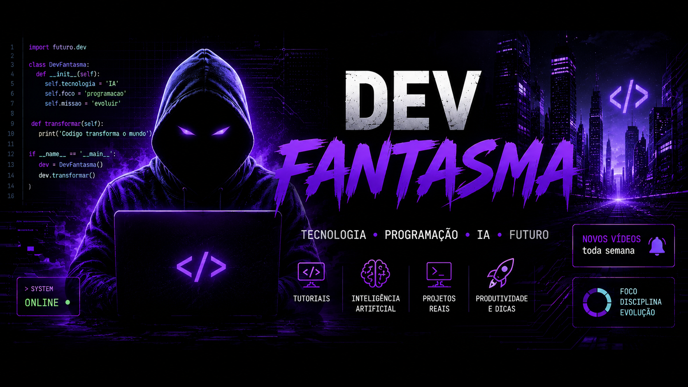

  

  
  
  
  

---

## Sobre mim

Sou desenvolvedor independente e criador do conceito **Dev Fantasma**, com foco em sistemas reais, automação, plataformas web, gerenciamento empresarial e soluções digitais que resolvem problemas operacionais.

Meu trabalho combina desenvolvimento **backend**, **frontend**, **banco de dados**, **automação**, **IA aplicada** e construção de ferramentas administrativas. Busco criar projetos com utilidade prática, boa organização técnica e espaço para evolução contínua.

<table>
  <tr>
    <td width="33%">
      <h3>Perfil</h3>
      <ul>
        <li>Desenvolvedor independente</li>
        <li>Foco em projetos próprios</li>
        <li>Construção de sistemas reais</li>
        <li>Visão prática de produto</li>
      </ul>
    </td>
    <td width="33%">
      <h3>Especialidades</h3>
      <ul>
        <li>Sistemas administrativos</li>
        <li>Automação de processos</li>
        <li>Aplicações web</li>
        <li>Servidores multiplayer</li>
      </ul>
    </td>
    <td width="33%">
      <h3>Diferencial</h3>
      <ul>
        <li>Integração entre negócio e tecnologia</li>
        <li>Projetos completos e evolutivos</li>
        <li>Identidade visual forte</li>
        <li>Foco em solução, não só código</li>
      </ul>
    </td>
  </tr>
</table>

---

## Tecnologias

<table>
  <tr>
    <td width="50%">
      <h3>Frontend</h3>
      

        
        
        
        
      

      
Interfaces web, painéis administrativos, páginas responsivas e experiências digitais limpas.

    </td>
    <td width="50%">
      <h3>Backend</h3>
      

        
        
        
      

      
APIs, regras de negócio, autenticação, integrações e lógica de sistemas administrativos.

    </td>
  </tr>
  <tr>
    <td width="50%">
      <h3>Banco de Dados</h3>
      

        
        
        
      

      
Modelagem, persistência, consultas, relatórios e organização de dados operacionais.

    </td>
    <td width="50%">
      <h3>DevOps e Infraestrutura</h3>
      

        
        
        
        
      

      
Versionamento, publicação, scripts operacionais, organização de ambiente e deploy.

    </td>
  </tr>
  <tr>
    <td width="50%">
      <h3>Automação e IA</h3>
      

        
        
        
      

      
Rotinas automatizadas, produtividade, análise, apoio operacional e recursos inteligentes.

    </td>
    <td width="50%">
      <h3>Ferramentas e Multiplayer</h3>
      

        
        
        
      

      
Gamemodes, comandos, economia, regras de servidor e experiências multiplayer.

    </td>
  </tr>
</table>

---

## Projetos em destaque

<table>
  <tr>
    <td width="50%">
      <h3><a href="https://github.com/luiz930/FORUM_SAMP_ONLINE">FORUM_SAMP_ONLINE</a></h3>
      
<strong>Objetivo:</strong> criar uma base web para comunidade, comunicação e organização de conteúdo ligado ao ecossistema SA-MP.

      
<strong>Funcionalidades:</strong> estrutura JavaScript, interface web, organização de páginas e base para recursos de fórum.

      
<strong>Diferencial técnico:</strong> projeto voltado a plataforma online, preparado para evoluir com autenticação, moderação e painel administrativo.

      

        
        
        
      

    </td>
    <td width="50%">
      <h3><a href="https://github.com/luiz930/autoflow-system">autoflow-system</a></h3>
      
<strong>Objetivo:</strong> estruturar uma base de sistema administrativo com foco em automação, gestão e operação empresarial.

      
<strong>Funcionalidades:</strong> rotinas automatizadas, telas web, regras de negócio, organização de dados e suporte a fluxos internos.

      
<strong>Diferencial técnico:</strong> projeto full stack com Python, HTML, TypeScript, JavaScript, CSS e estrutura preparada para evolução.

      

        
        
        
      

    </td>
  </tr>
  <tr>
    <td width="50%">
      <h3><a href="https://github.com/luiz930/luiz930">luiz930</a></h3>
      
<strong>Objetivo:</strong> manter o README principal do perfil GitHub como portfólio visual e apresentação profissional.

      
<strong>Funcionalidades:</strong> banner personalizado, identidade Dev Fantasma, badges, estatísticas, projetos destacados e contato.

      
<strong>Diferencial técnico:</strong> perfil organizado para oportunidades, freelas e apresentação dos projetos reais em um único ponto.

      

        
        
        
      

    </td>
    <td width="50%">
      <h3><a href="https://github.com/luiz930/GM_SAMP_GTA_SAN_ANDREAS">GM_SAMP_GTA_SAN_ANDREAS</a></h3>
      
<strong>Objetivo:</strong> desenvolver uma base multiplayer com sistemas de jogo, comandos, regras e estrutura de servidor.

      
<strong>Funcionalidades:</strong> gamemode, lógica de servidor, scripts auxiliares, comandos e recursos para experiência online.

      
<strong>Diferencial técnico:</strong> grande base em Pawn com apoio de scripts operacionais, foco em estabilidade e evolução de gameplay.

      

        
        
        
      

    </td>
  </tr>
</table>

  

---

## O que estou estudando

<table>
  <tr>
    <td width="25%" align="center">
      <strong>IA aplicada</strong> 
      automações inteligentes, produtividade e recursos para sistemas reais
    </td>
    <td width="25%" align="center">
      <strong>Arquitetura web</strong> 
      backend mais organizado, APIs melhores e interfaces escaláveis
    </td>
    <td width="25%" align="center">
      <strong>Banco de dados</strong> 
      modelagem, relatórios, desempenho e consistência de dados
    </td>
    <td width="25%" align="center">
      <strong>Deploy e operação</strong> 
      publicação, monitoramento, backups e estabilidade
    </td>
  </tr>
</table>

---

## Estatísticas GitHub

  <picture>
    <source media="(prefers-color-scheme: dark)" srcset="https://github-readme-stats.vercel.app/api?username=luiz930&show_icons=true&hide_border=true&rank_icon=github&theme=tokyonight&locale=pt-br&title_color=8B5CF6&icon_color=38BDF8" />
    <source media="(prefers-color-scheme: light)" srcset="https://github-readme-stats.vercel.app/api?username=luiz930&show_icons=true&hide_border=true&rank_icon=github&theme=default&locale=pt-br&title_color=7C3AED&icon_color=0EA5E9" />
    
  </picture>
  <picture>
    <source media="(prefers-color-scheme: dark)" srcset="https://github-readme-stats.vercel.app/api/top-langs/?username=luiz930&layout=compact&hide_border=true&theme=tokyonight&locale=pt-br&title_color=8B5CF6" />
    <source media="(prefers-color-scheme: light)" srcset="https://github-readme-stats.vercel.app/api/top-langs/?username=luiz930&layout=compact&hide_border=true&theme=default&locale=pt-br&title_color=7C3AED" />
    
  </picture>

  <picture>
    <source media="(prefers-color-scheme: dark)" srcset="https://streak-stats.demolab.com?user=luiz930&theme=tokyonight&hide_border=true&locale=pt_BR&date_format=j%20M%5B%20Y%5D" />
    <source media="(prefers-color-scheme: light)" srcset="https://streak-stats.demolab.com?user=luiz930&theme=default&hide_border=true&locale=pt_BR&date_format=j%20M%5B%20Y%5D" />
    
  </picture>

  <picture>
    <source media="(prefers-color-scheme: dark)" srcset="https://github-readme-activity-graph.vercel.app/graph?username=luiz930&theme=github-compact&hide_border=true&area=true" />
    <source media="(prefers-color-scheme: light)" srcset="https://github-readme-activity-graph.vercel.app/graph?username=luiz930&theme=minimal&hide_border=true&area=true" />
    
  </picture>

---

## Objetivos

<table>
  <tr>
    <td width="33%">
      <h3>Construir soluções reais</h3>
      
Desenvolver sistemas úteis para empresas, operações, atendimento, gestão e plataformas online.

    </td>
    <td width="33%">
      <h3>Elevar qualidade técnica</h3>
      
Melhorar arquitetura, segurança, desempenho, usabilidade, documentação e manutenção dos projetos.

    </td>
    <td width="33%">
      <h3>Criar portfólio forte</h3>
      
Transformar projetos próprios em provas concretas de capacidade técnica, criatividade e evolução.

    </td>
  </tr>
</table>

---

## Contato

  
  
  

  <strong>Aberto a projetos, parcerias, freelas e oportunidades ligadas a sistemas web, automação e soluções digitais.</strong>

